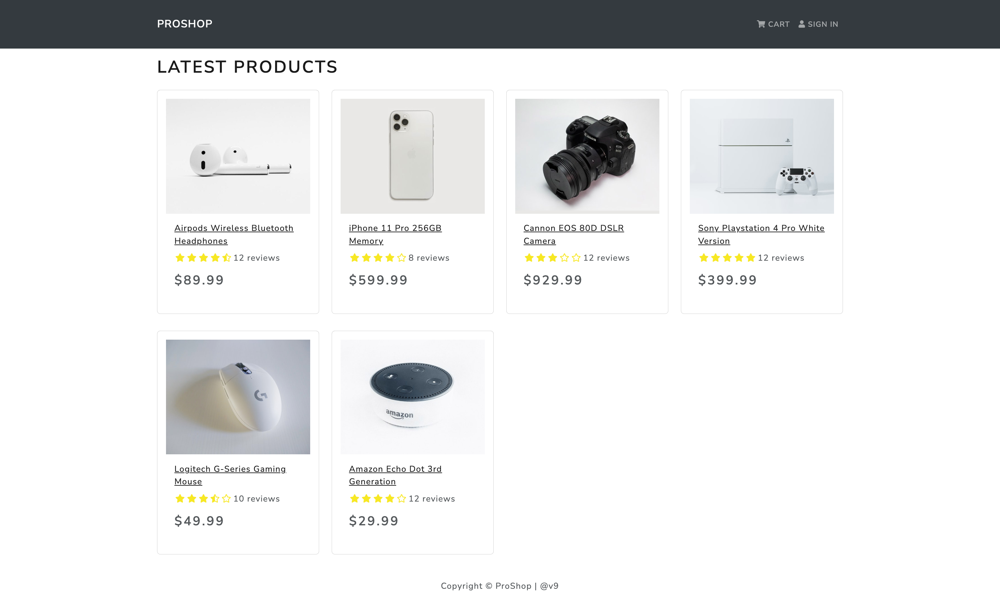
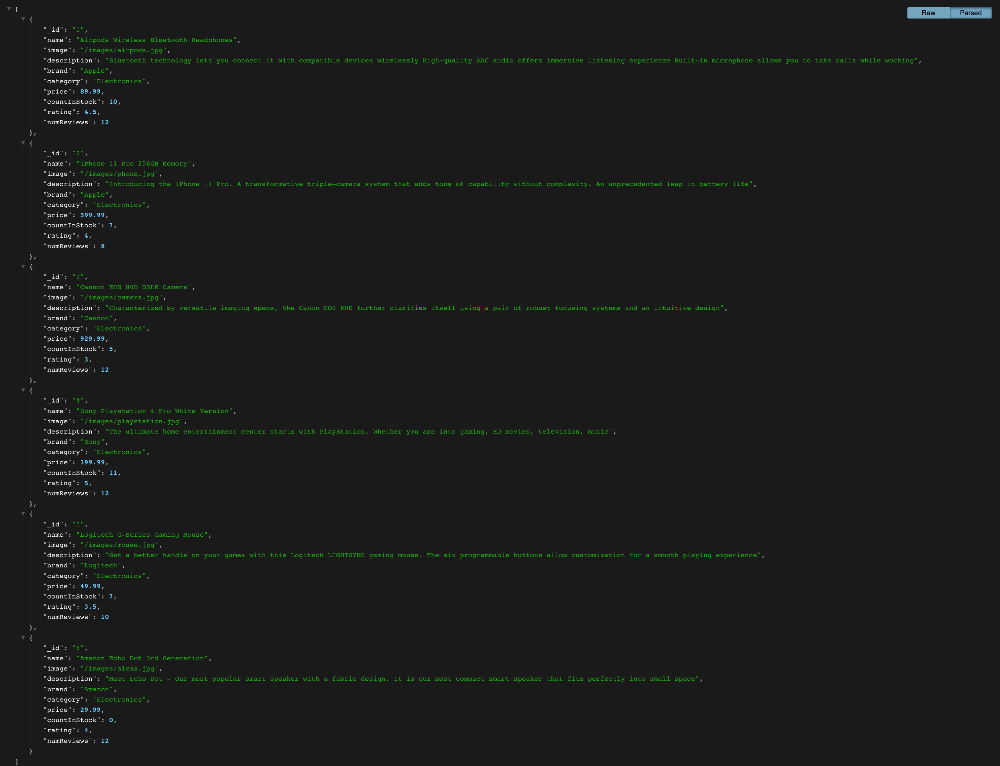
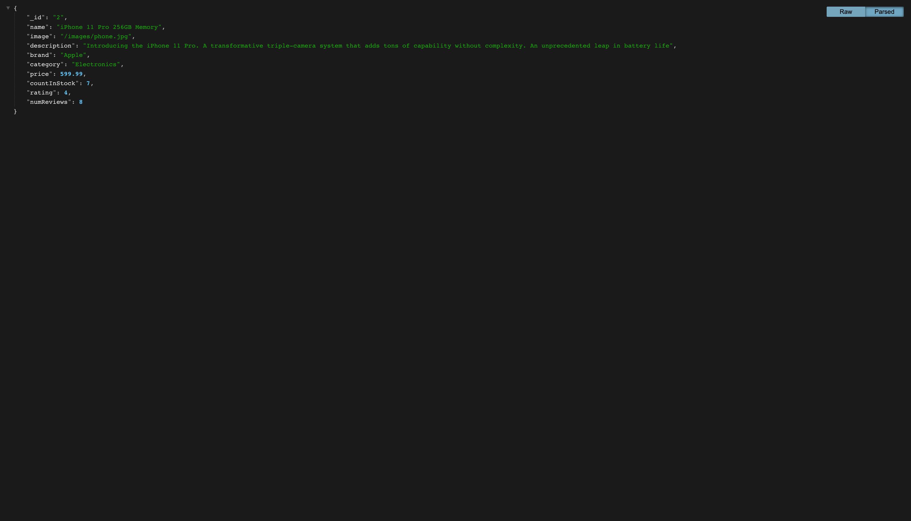

## version-9

`http://localhost:3000`

`http://localhost:3000/product/1`

`http://localhost:9000/api/products`

`http://localhost:9000/api/products/2`

## HOW TO RUN 'MERN_PROSHOP' `APP` ON YOUR LOCAL SERVER

`https://docs.google.com/document/d/1BIq_PNnn4a0JZLYvBmdasQANedGOtMrPeyWr8Zx4GnM/edit?usp=sharing`

## TO RUN THE PROJECT LOCALLY

IN THE PROJECT ROOT DIRECTORY, RUN:

### `npm run dev` [ It will run frontend and backend at a same time ]

OPEN [http://localhost:3000/](http://localhost:3000/) TO VIEW `Home Page` IN YOUR BROWSER.

##

IF YOU WANT TO RUN ONLY BACKEND

IN THE PROJECT ROOT DIRECTORY, RUN:

### `npm run server` [ It will run only backend server ]

OPEN [http://localhost:9000/api/products](http://localhost:9000/api/products) TO VIEW BACKEND IN YOUR BROWSER.

##

IF YOU WANT TO RUN ONLY FRONTEND

IN THE PROJECT ROOT DIRECTORY, RUN:

### `npm run client` [ It will run only frontend server ]
