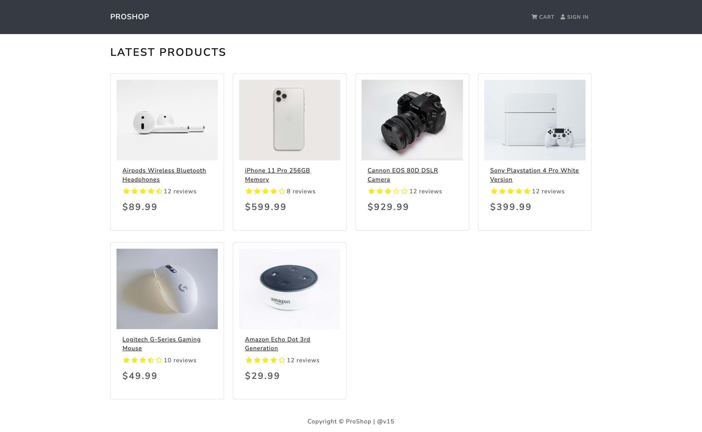
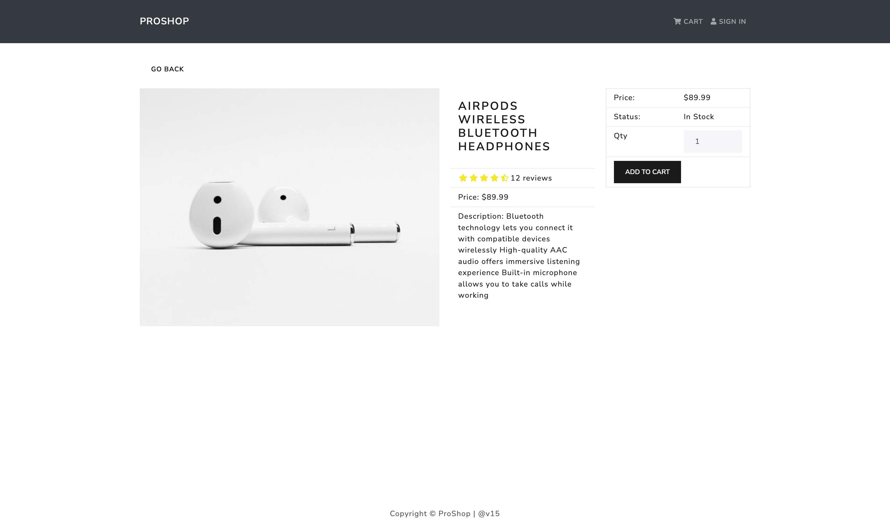
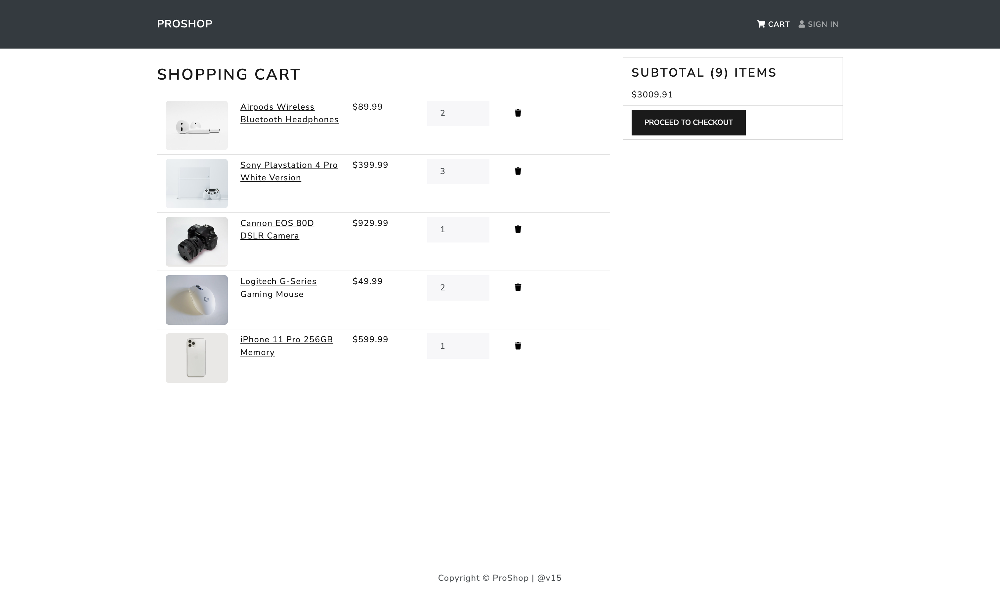
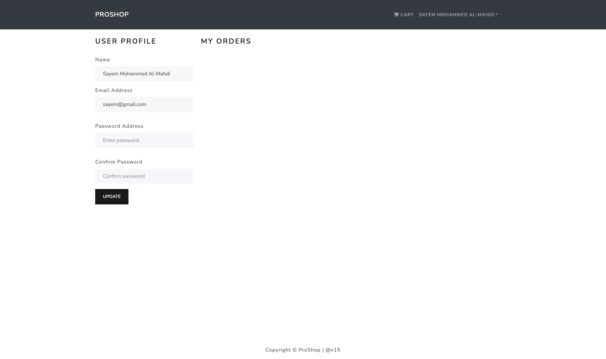

## version-15

`http://localhost:3000`



`http://localhost:3000/product/63e3a82c56b348ae70521c9c`



`http://localhost:3000/cart`



`http://localhost:3000/profile`



`http://localhost:9000/api/products`


`http://localhost:9000/api/products/63e3a82c56b348ae70521c9c`


`MongoDB+Compass+Image+proshop:products.png`


`MongoDB+Compass+Image+proshop:users.png`


`Postman+{{URL}}:api:products.png`


`Postman+{{URL}}:api:products:63e3a82c56b348ae70521c9c.png`


`Postman+{{URL}}:api:users:login.png`


`Postman+{{URL}}:api:users:profile(GET).png`


`Postman+{{URL}}:api:users.png`


`Postman+{{URL}}/api/users/profile(PUT).png`


`cloud.mongodb+collections+proshop+products.png`


`cloud.mongodb+collections+proshop+users.png`


## HOW TO RUN 'MERN_PROSHOP' `APP` ON YOUR LOCAL SERVER

```
https://docs.google.com/document/d/1BIq_PNnn4a0JZLYvBmdasQANedGOtMrPeyWr8Zx4GnM/edit?usp=sharing
```

## Usage

### ES Modules in Node

We use ECMAScript Modules in the backend in this project. Be sure to have at least Node v14.6+ or you will need to add the "--experimental-modules" flag.

Also, when importing a file (not a package), be sure to add .js at the end or you will get a "module not found" error

You can also install and setup Babel if you would like <br><br>

### Env Variables

Create a .env file in then root and add the following

```
NODE_ENV = development
PORT = 9000
MONGO_URI = your mongodb uri
JWT_SECRET = 'Your JWT Secret'
PAYPAL_CLIENT_ID = your paypal client id
```

### Install Dependencies (frontend & backend)

```
In the project root directory, Run :-
npm install
cd frontend
npm install
```

### Run

```
# Run both frontend (http://localhost:3000) & backend (http://localhost:9000/api/products)
In the project root directory, Run :-
npm run dev

# If you want to run backend only, in the project root directory,
Run :-
npm run server

# If you want to run frontend only, in the project root directory,
Run :-
npm run client
```

## Build & Deploy

```
# Create frontend prod build
cd frontend
npm run build
```

There is a Heroku postbuild script, so if you push to Heroku, no need to build manually for deployment to Heroku

### Seed Database

You can use the following commands to seed the database with some sample users and products as well as destroy all data

```
# Import data
npm run data:import

# Destroy data
npm run data:destroy
```

```
Sample User Logins

admin@example.com (Admin)
123456

john@example.com (Customer)
123456

jane@example.com (Customer)
123456
```
