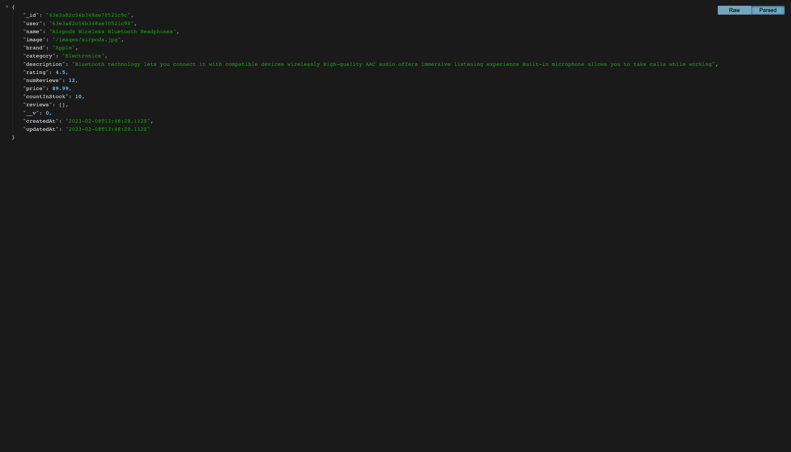

`http://localhost:9000/api/products`

`http://localhost:9000/api/products/63e3a82c56b348ae70521c9c`

`MongoDB+Compass+Image+proshop:products.png`

`MongoDB+Compass+Image+proshop:users.png`

`Postman+{{URL}}:api:products.png`

`Postman+{{URL}}:api:products:63e3a82c56b348ae70521c9c.png`

`Postman+{{URL}}:api:users:login.png`

`Postman+{{URL}}:api:users:profile(GET).png`

`Postman+{{URL}}:api:users.png`

`Postman+{{URL}}/api/users/profile(PUT).png`

`cloud.mongodb+collections+proshop+products.png`

`cloud.mongodb+collections+proshop+users.png`

